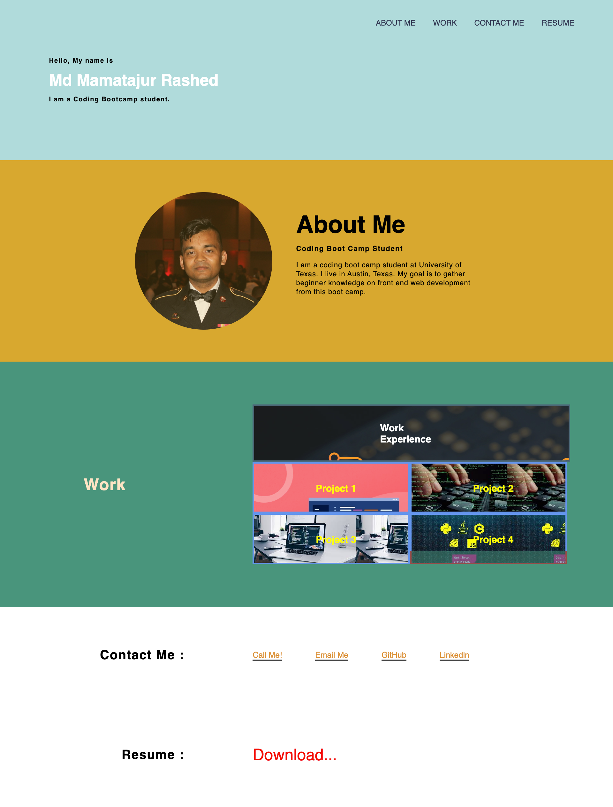

# Weekly Challenge Project - two

## Md Mamatajur Rashed Digital Resume

 

## Acceptance Criteria :

GIVEN I need to sample a potential employee's previous work
 
WHEN I load their portfolio

THEN I am presented with the developer's name, a recent photo or avatar, and links to sections about them, their work, and how to contact them 

WHEN I click one of the links in the navigation
 

THEN the UI scrolls to the corresponding section
 

WHEN I click on the link to the section about their work  

THEN the UI scrolls to a section with titled images of the developer's applications  

WHEN I am presented with the developer's first application  

THEN that application's image should be larger in size than the others  

WHEN I click on the images of the applications  

THEN I am taken to that deployed application  

WHEN I resize the page or view the site on various screens and devices  

THEN I am presented with a responsive layout that adapts to my viewport

## Table of Contents

1. Project Title

2. Description

3. Installation

4. How to use the Project

5. Screenshots

6. links

7. Build With

## Description:

 This is a digital resume created using HTML and CSS. The purpose of this project is to showcase my skills and experience to potential employers.

## Installation :

- Git, SSH Key, Github Account, VS Code, Google Chrome

 

## How to use the Project:

 
 This project is a Digital Resume which is used to contact with me. it's shows my project what i have done. 

 

## Screenshots :

## Links:

[Md Rashesd's Deployed Application](https://mdrashed30.github.io/02-weekly-challange--2023/)

## Build With:

- HTML
- CSS
