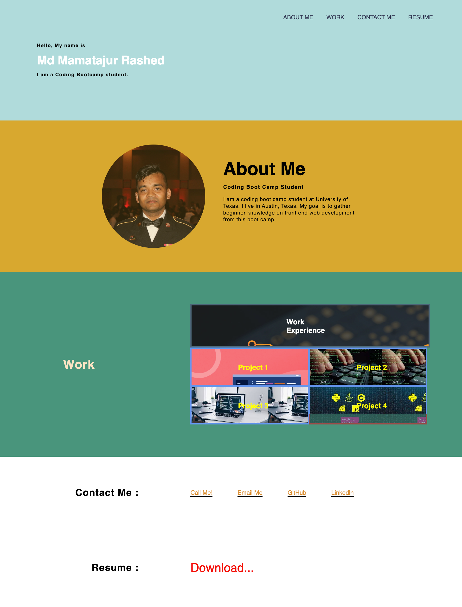

# Professional Portfolio

## Description

This is a digital resume created using HTML and CSS. The purpose of this project is to showcase my skills and experience to potential employers.

## Table of Contents

1. [The Task](#The-task)
2. [Install](#install)
3. [Languages Used](#languages-used)
4. [screenshot](#Screenshot)
5. [Links](#links)
6. [acknowledgements](#acknowledgements)
7. [credit](#credit)

## The Task

### User Story

- AS AN employer
- I WANT to view a potential employee's deployed portfolio of work samples
- SO THAT I can review samples of their work and assess whether they're a good candidate for an open position

## Acceptance Criteria :

- GIVEN I need to sample a potential employee's previous work
- WHEN I load their portfolio
- THEN I am presented with the developer's name, a recent photo or avatar, and links to sections about them, their work, and how to contact them
- WHEN I click one of the links in the navigation
- THEN the UI scrolls to the corresponding section
- WHEN I click on the link to the section about their work
- THEN the UI scrolls to a section with titled images of the developer's applications
- WHEN I am presented with the developer's first application
- THEN that application's image should be larger in size than the others
- WHEN I click on the images of the applications
- THEN I am taken to that deployed application
- WHEN I resize the page or view the site on various screens and devices
- THEN I am presented with a responsive layout that adapts to my viewport

## Installation :

- Git
- SSH Key
- Github Account
- VS Code
- Google Chrome

## Languages Used

- HTML
- CSS

## Screenshots :

## Links:

[Deploy](https://mdrashed30.github.io/Md-Resume/)

[Github ](https://github.com/mdRashed30/Md-Resume.git)

## Build With:

- HTML
- CSS

## Credit :

- TA
